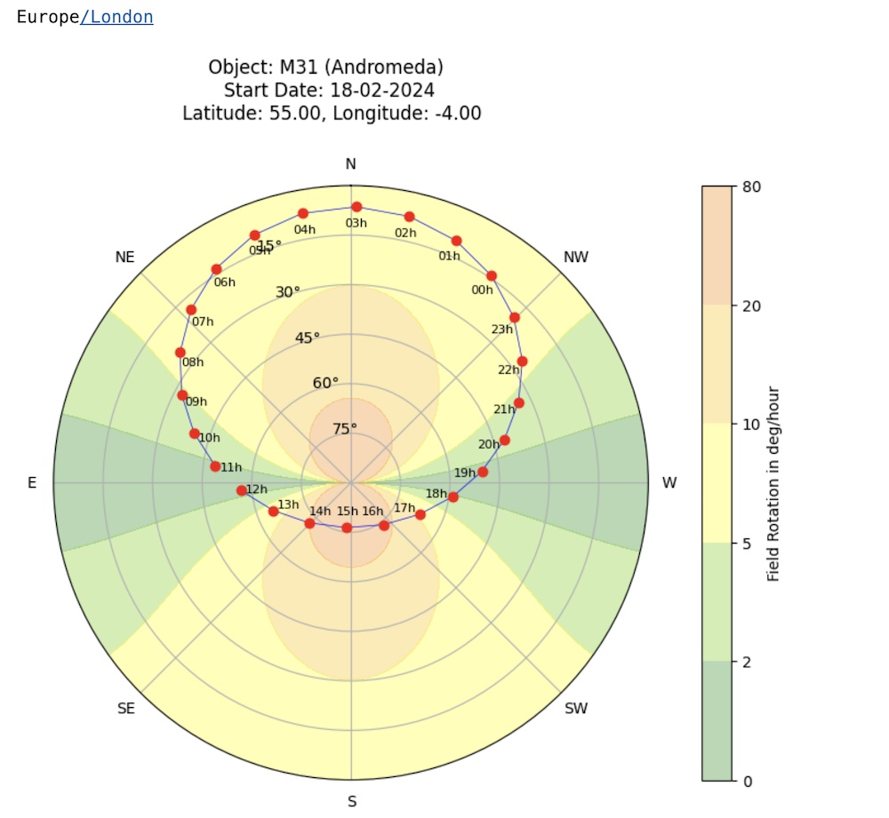

## **Field Rotation Calculator**

### **Introduction**

Doing astrophotography with an altazimuth mounted telescope or lens has a limitation not seen with equatorially mounted scopes.

They suffer from what is known as "field rotation" - as the telescope tracks an object across the sky, the framing of the picture changes, leaving you with noise in the corners of the image, and thus reducing the useful imaging area.

The effect varies both with your latitude, and the position of the object in the sky - generally east/west is better than north/south. The code here is intended to help you find a good time to image a given object from your location.

You can specify your location, a start time for observation, and the object you are interested in. A chart is created showing the object moving in your sky over the next 24 hours.

In the example below, you can see that a good time for imagining M31 would be between 7pm and 9pm where the field rotation is between about only 1 and 5 degrees per hour and the object is still quite high. If it were dark, between 2pm and 4pm would be very bad - over 20 degrees per hour, probably much more!

**Note:** The chart shows the *magnitude* of the field rotation effect, since the idea is to show whether an area is good or bad for imaging. The effect is actually opposite in the south and north however (clockwise in one, and anticlockwise in the other).

Additionally, there is a second workbook that can generate an animation of the field rotation effect for a range of latitudes.

The programs are presented as "Jupyter" python notebooks. The intention here is not really to provide a standalone tool with a gui etc, but to show what is possible with various Python libraries that are freely available.

### **Installation**

First of all, you will need some way of running Jupyter notebooks (https://jupyter.org). 

My preferred approach is to set this up within VSCode, but you can also install a Jupyter server on your computer that you run from your browser - there are plenty of good guides to follow for both these days on the net.

You will then probably want to find a simple tutorial about how to work with Jupyter notebooks if you've not used them before.

There are a number of libraries you will need to install: astropy, astroquery, numpy, pytz, and timezonefinder. See the webpages for the libraries, but mostly this is as simple as "pip install xyz" in your command line e.g.

~~~
pip install astroquery
~~~

### **Running the code**

Start by loading the FieldRotationCalculator.ipynb file, and clicking "run all" to make sure all cells in the file have run. You should see something like the chart above, along with a table showing the field rotation for each hour the object is above the horizon.

Then you can change the following cell and change the location, time and object before running it again to get your chart:

~~~
observer = EarthLocation(lat=55.0, lon=-4) # Latitude and longitude of observer
start_datetime = datetime.datetime(2024, 2, 18, 12, 0, 0)  # Start date and time of observation

observing_info = show_field_rotation_and_object(observer,start_datetime,"M31")

observing_info.show_in_notebook()
~~~

### **Animation**

The second notebook will create an animation as we move from 0 degrees latitude to the north pole of the field rotation effect. You will need FFMPEG installed on your system.

### **Basic program logic**

Please see the notebooks for (a bit!) more detail on how we calculate the field rotation and get the locations of the objects.
